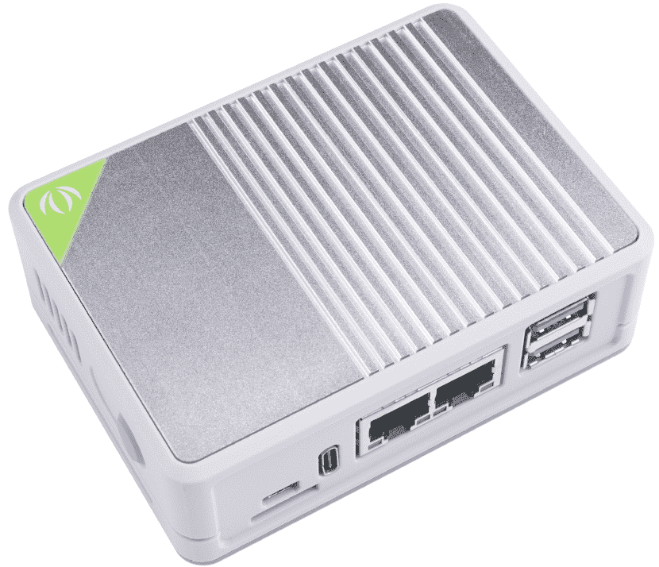

# openwrt-seeed-carrier-board

This repo contains instructions how to install **Current Stable Release - OpenWrt 21.02.1** to [seeed carrier board](https://www.seeedstudio.com/Dual-GbE-Carrier-Board-with-4GB-RAM-32GB-eMMC-RPi-CM4-Case-p-5029.html)



### Congratulations ! You are happy owner of Dual Gigabit Mini Router/PC raspberry pi 4 board :)

### So what is the problem
This board typically have openwrt firmware preinstalled.
The problem is that [seeed openwrt versions](https://onedrive.live.com/?authkey=%21AEcwsyZAovIBK%2DI&id=5219529519B9B6A1%21963&cid=5219529519B9B6A1) are built on top of openwrt [snapshots](https://downloads.openwrt.org/snapshots/targets/bcm27xx/bcm2711/). \
Snapshot version is often unstable, incompatible with the stable release and quickly changes. \
It means that if you need to install some package (for example ebtables) that depends on kernel module kmod-* it is often
impossible (due to kernel incompatibility) without rebuilding everything from scratch.

From another side [seeed custom builds](https://onedrive.live.com/?authkey=%21AEcwsyZAovIBK%2DI&id=5219529519B9B6A1%21963&cid=5219529519B9B6A1)
contains a lot of pre-installed software that you don't need in most of the cases and
have to manually remove/uninstall to get stable work of the board.

### Why do you need to install official openwrt stable release
This is a [stable and well tested](https://downloads.openwrt.org/releases/21.02.1/targets/bcm27xx/bcm2711/) openwrt release.\
It contains a lot of packages, and you have a freedom to install any software without 
facing incompatibility issues.

### What is the current stable release of openwrt for seeed carrier board
At the moment there is [**OpenWrt 21.02.1 release for seeed carrier board**](https://openwrt.org/releases/21.02/start)

### How to install official openwrt release to seeed carrier board
* Download [openwrt-21.02.1-bcm27xx-bcm2711-rpi-4-ext4-factory.img](https://downloads.openwrt.org/releases/21.02.1/targets/bcm27xx/bcm2711/openwrt-21.02.1-bcm27xx-bcm2711-rpi-4-ext4-factory.img.gz) image 
* Follow [this guide](https://wiki.seeedstudio.com/OpenWrt-Getting-Started/#initial-set-up) to install it to your carrier board
* After flashing your device will be available by ip address `192.168.1.1` with DHCP enabled on LAN interface

### How to make the second ethernet adapter working

Once [this PR](https://github.com/openwrt/openwrt/pull/4893) will be merged and new version of openwrt released ethernet adapter will be working after `opkg install kmod-usb-net-lan78xx`.

Until it's done:

The second ethernet adapter requires [lan78xx driver](https://github.com/Seeed-Studio/seeed-linux-openwrt/tree/magic/packages/lan78xx). \
The problem is that official release doesn't include it and we have to compile it separately. \
The goods news is that I've already done that for you :)

To make it work you need:

1) Download [the driver](files/lan78xx/21.02.1/lan78xx.ko) to your carrier board (remember it's compatible only with the release 21.02.1)
2) Copy to the `/lib/modules/5.4.154/lan78xx.ko`
3) Create a file `/etc/modules.d/lan78` with one line `lan78xx`
4) Reboot and check `dmesg`
5) If you see something like 
```
[    8.563700] 8021q: adding VLAN 0 to HW filter on device eth1
```
It means that driver is successfully loaded and new adapter is ready to work
```
ip l show eth1
3: eth1: <NO-CARRIER,BROADCAST,MULTICAST,UP> mtu 1500 qdisc fq_codel state DOWN qlen 1000```
    link/ether 2c:f7:f1:1b:eb:c5 brd ff:ff:ff:ff:ff:ff
```

### How to make wifi module working
This board has Wi-Fi module, but it doesn't work with the official openwrt release.

Once [this PR merged and released](https://github.com/openwrt/openwrt/pull/4892) in new openwrt version it should be working out of the box.

Until it's done:
1) Install packages `opkg install kmod-brcmfmac cypress-nvram-43455-sdio-rpi-4b`
2) Copy firmware `cp /lib/firmware/brcm/brcmfmac43455-sdio.raspberrypi,4-model-b.txt /lib/firmware/brcm/brcmfmac43455-sdio.raspberrypi,4-compute-module.txt`
4) Reboot and check `dmesg`
5) If you see something like
```
[    7.297796] brcmfmac: brcmf_fw_alloc_request: using brcm/brcmfmac43455-sdio for chip BCM4345/6
[    7.456529] brcmfmac: brcmf_fw_alloc_request: using brcm/brcmfmac43455-sdio for chip BCM4345/6
[    7.474797] brcmfmac: brcmf_c_preinit_dcmds: Firmware: BCM4345/6 wl0: Mar 23 2020 02:20:01 version 7.45.206 (r725000 CY) FWID 01-febaba43
[    7.515582] usbcore: registered new interface driver brcmfmac
```
It means that wlan driver is successfully loaded is ready to work 
```
ip l show wlan0
8: wlan0: <BROADCAST,MULTICAST> mtu 1500 qdisc noop state DOWN qlen 1000
    link/ether e4:5f:01:3d:2c:8e brd ff:ff:ff:ff:ff:ff
```

### Initial /dev/root partition is too small
Indeed, when you install official openwrt firmware by default root partition is only about **104Mb**. \
But this board has an emmc storage with **32Gb**, 104Mb for root partition is ridiculously small. \
Let's fix it and increase up to **4Gb**. \
We need to increase the partition `/dev/mmcblk0p2` of `/dev/mmcblk0` device and resize ext4 fs on that partition.

To make it possible I recommend installing the following packages: 
```
opkg install lsblk resize2fs tune2fs fdisk
```
Step by step instructions:
1) ` fdisk /dev/mmcblk0` then press `p`
```
Disk /dev/mmcblk0: 29.12 GiB, 31268536320 bytes, 61071360 sectors
Units: sectors of 1 * 512 = 512 bytes
Sector size (logical/physical): 512 bytes / 512 bytes
I/O size (minimum/optimal): 512 bytes / 512 bytes
Disklabel type: dos
Disk identifier: 0x26a7c3c5

Device         Boot  Start     End Sectors Size Id Type
/dev/mmcblk0p1 *      8192  139263  131072  64M  c W95 FAT32 (LBA)
/dev/mmcblk0p2      147456  352256  360448  104M 83 Linux
```
Remember start sector of the second partition (in my case it is 147456)
2) press `d` then `2`
```
Partition 2 has been deleted.
```
3) press `n` then `p` then `2` then type first sector `147456` then `+4G`
```
Created a new partition 2 of type 'Linux' and of size 4 GiB.
Partition #2 contains a ext4 signature.
```
4) If asked `Do you want to remove the signature?` press `N`
5) press `w`
6) Reboot
7) Resize fs on /dev/root by running command `resize2fs /dev/mmcblk0p2`
8) If everything goes ok you should see something like
```
df -h
Filesystem                Size      Used Available Use% Mounted on
/dev/root                 3.9G    108.0M      3.8G   3% /
tmpfs                     1.9G     13.6M      1.8G   1% /tmp
/dev/mmcblk0p1           63.9M     15.7M     48.2M  25% /boot
tmpfs                   512.0K         0    512.0K   0% /dev
```
9) Viola :) `/dev/root` partition has been successfully increased !

If you are experiencing problems and see errors like:
* `resize2fs: Invalid argument While checking for on-line resizing support`
* `resize2fs: Invalid argument While trying to add group #1`

Try the following steps:

1) Stop all services using this partition.
2) `mount / -o remount,ro`
3) `tune2fs -O^resize_inode /dev/mmcblk0p2`
4) `fsck.ext4 /dev/mmcblk0p2`
5) Reboot
6) `resize2fs /dev/mmcblk0p2`